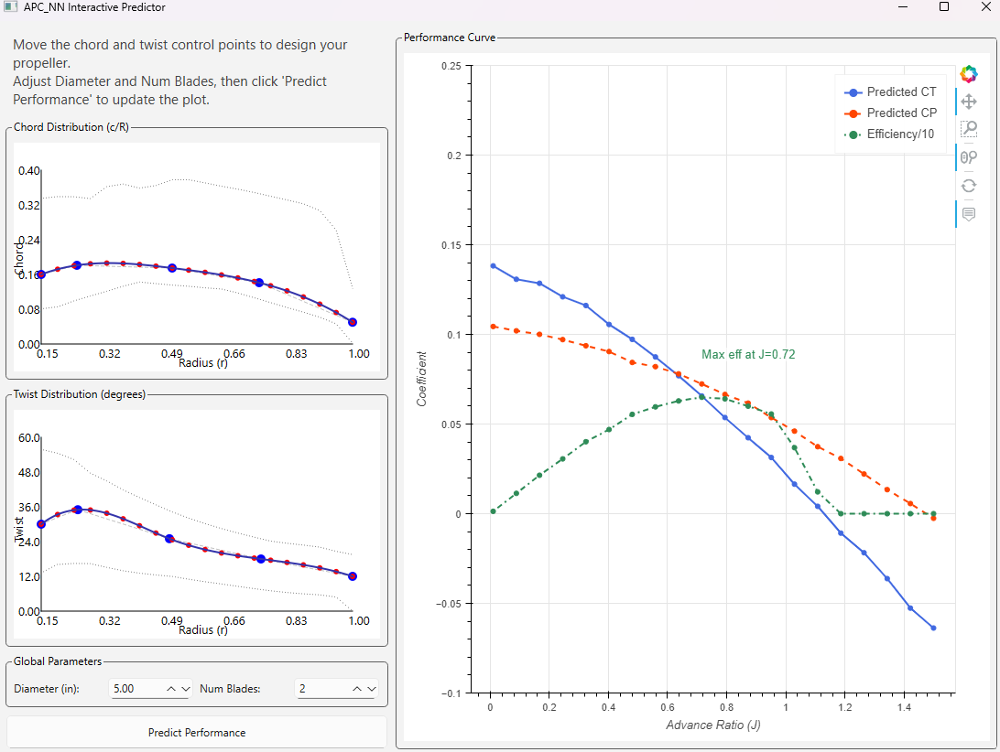

# Propeller Performance Neural Network Predictor

## Purpose

This project provides a tool to predict the performance characteristics of a propeller based on its geometric properties and operating conditions. The primary purpose is to offer a fast, interactive way to evaluate propeller designs without the need for complex simulations or physical wind tunnel tests.

It uses a PyTorch-based neural network (a 1D Convolutional Neural network) to learn the relationship between propeller geometry (radius, chord, twist) and its resulting performance coefficients (Thrust Coefficient CT, Power Coefficient CP) across a range of advance ratios (J).

Current training data is based on UIUC APC Propeller Database.

## Key Features

- **Interactive GUI**: A user-friendly graphical interface built with PySide6 and Bokeh that allows for real-time manipulation of propeller geometry and immediate visualization of the predicted performance.
- **Neural Network Model**: A CNN-based model (`PropNet`) that processes geometric distributions to predict performance curves.
- **Modular Codebase**: The core model logic, training scripts, and GUI are separated for maintainability and clarity.
- **Command-Line and GUI Operation**: Can be run from the command line for batch processing or through the interactive GUI for design exploration.

## Setup and Installation

1.  **Clone the repository:**
    ```bash
    git clone <repository-url>
    cd <repository-directory>
    ```

2.  **Create a virtual environment (recommended):**
    ```bash
    python -m venv venv
    source venv/bin/activate  # On Windows, use `venv\Scripts\activate`
    ```

3.  **Install the required packages:**
    ```bash
    pip install -r requirements.txt
    ```

## Usage

### 1. Interactive Prediction (GUI)

This is the primary way to use the application. Run the GUI script from the root directory:

```bash
python gui_apc_nn.py
```

This will launch a window where you can:
- Interactively modify the chord and twist distributions by dragging control points.
- Set the propeller's diameter and number of blades.
- Click "Predict Performance" to see the `CT` and `CP` curves instantly.
- The plot is interactive: use the mouse to zoom, pan, and hover over points to see their values.

### 2. Training the Model

To retrain the model with new data, you will need to prepare your data and then run the training script:

```bash
python learn_apc.py
```
This script will read the data, train the `PropNet` model, and save the trained weights and scalers to the `model_weights/` directory.

### 3. Command-Line Inference

To run a single prediction from the command line using the default example data in the script:

```bash
python run_model.py
```

## File Structure

0. `requirements.txt`: A list of all Python dependencies for the project.
1. `process_data.py`: Process data processes the UIUC database. Currently misses some 
2. `nn_functions.py`: A core module containing the `PropNet` class definition and shared functions for loading the model and making predictions.
3. `learn_apc.py`: The script used to train the neural network model.
4. `model_weights/`: The default directory containing the trained model (`propnet_weights.pt`), metadata (`meta.json`), and data scalers (`.joblib` files).
5. `run_model.py`: A command-line script to perform a single prediction.
6. `gui_apc_nn.py`: The main entry point for the interactive GUI application.

## Propeller Design GUI
The Propeller Design GUI provides an intuitive interface for users to design and evaluate propeller performance. With this GUI, users can easily adjust the chord and twist distributions of a propeller by dragging control points on the plot. The interface allows for real-time updates, enabling users to instantly visualize the effects of their modifications on the thrust (`CT`) and power (`CP`) coefficients. Additionally, users can specify the propeller's diameter and the number of blades, making it a versatile tool for various design scenarios. The interactive plot supports zooming, panning, and hovering over data points to display detailed values, enhancing the user experience and providing valuable insights into propeller performance characteristics.



